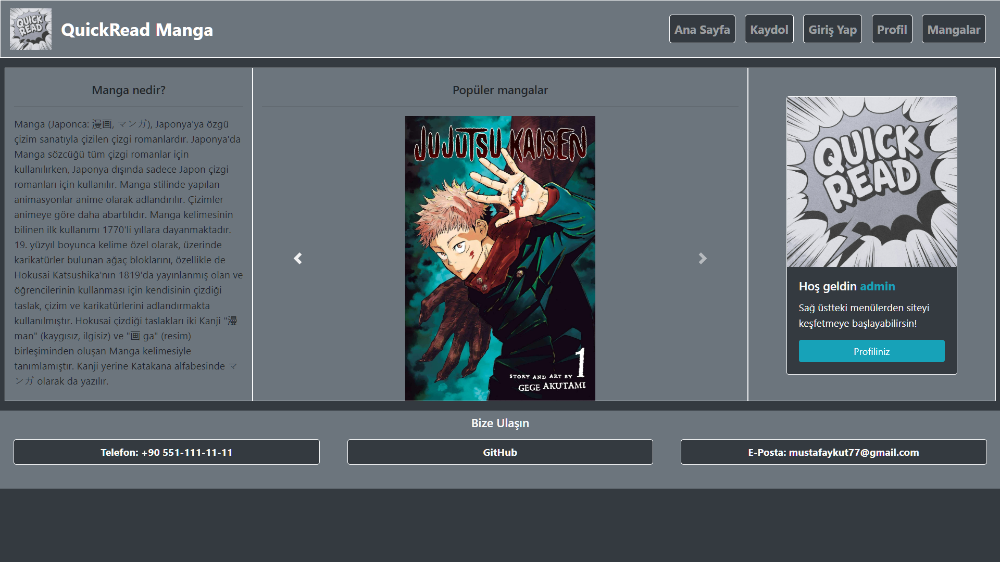
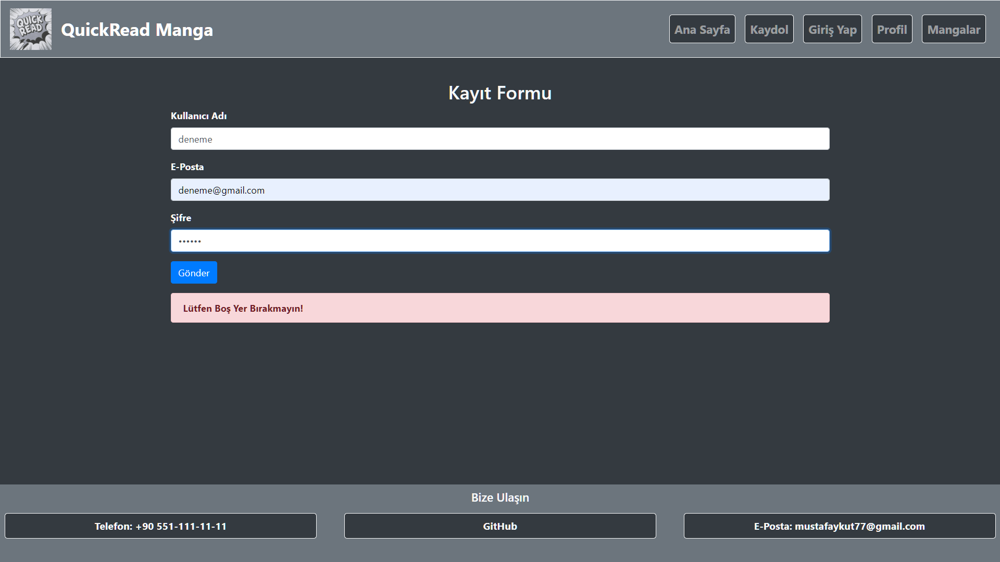
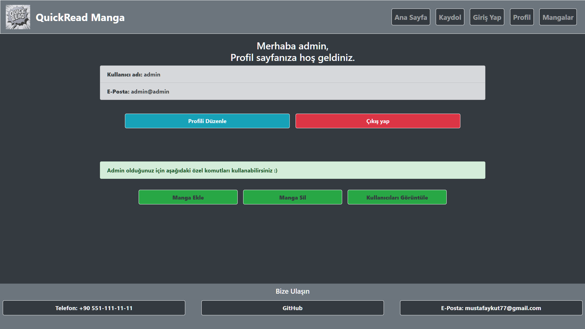

# PHP+Mysql Web Uygulaması Projesi

## Proje Tanıtım Videosu
[Video](#)

## Projenin Tanıtımı

* İlk olarak Manga nedir? Mangayı çok kısa bir şekilde açıklamak gerekirse Japon çizgi romanıdır. 
* Bu proje Bootstrap v4.6 kütüphaneleri ile oluşturulmuş bir manga okuma sitesi simülasyonudur. Siteye üye olabilir, profilinizi görebilir ve düzenleyebilirsiniz.
* Mangaları keşfedebilir, eğer ki kullanıcı adınız "admin" ise siteye manga ekleyebilir, manga ve kullanıcıları silebilirsiniz.

## Projeyi XAMPP ile localhost'ta nasıl çalıştırırım?

* Proje dosyalarını indirdikten sonra XAMPP uygulamasının kurulu olduğu dizine gidilir.
* xampp klasörünün içindeki htdocs dosyasına girilir.
* Bu dosyanın içinde proje_xampp adında bir klasör açılır ve içine indirilen proje dosyaları atılır.
* XAMPP uygulamasından Apache ve MySQL başlatılır.
* Tarayıcıda localhost/phpmyadmin adresine gidilir.
* Sol üstten SQL kodları yazma kısmına proje dosyaları içindeki Veritabani.sql dosyasındaki kodlar yazılır ve Git tuşuna tıklanır.
* Veri tabanında tablolar ve örnek 3 manga oluşur.
* Tarayıcıdan localhost/proje_xampp adresine gidilir.
* Artık site erişime açıktır iyi kullanımlar dilerim.

## Sitede yapabilecekleriniz

### Ana sayfa:
* Sağ üstteki menülerden site içinde dolaşabilirsiniz.
* En alttaki menüden de bana ulaşabilirsiniz.
### Kaydolma:
* Kullanıcı adı, e-posta ve istenilen şifre ile siteye kaydolunur.
### Giriş Yapma:
* Kayıt olan kişi kullanıcı adı ve şifresi ile siteye giriş yapar.
### Profil:
* Bu sayfada kişisel bilglerinizi görebilir, düzenleyebilir veya çıkış yapabilirsiniz.
* Ekstra olarak kullanıcı adınız "admin" ise siteye manga ekleyebilir, silebilir veya kullanıcıları görüntüleyebilirsiniz.
### Mangalar:
* Burada sitede kayıtlı olan mangalara ve özelliklerine bakabilirsiniz.

## Siteden bazı görseller
### Ana sayfa
### 
### Kayıt olma
### 
### Admin Profili
### 

## Projeyi Yapan
Mustafa AYKUT
